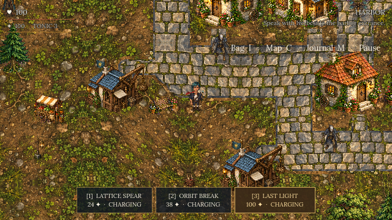
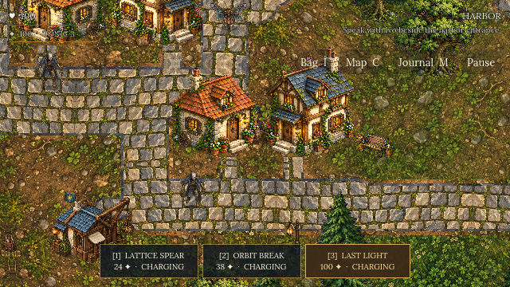
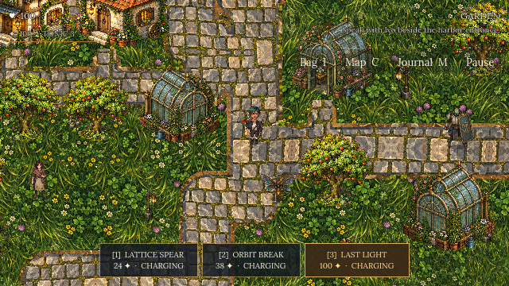

# Lattice of the Last Light

An open-world science-fantasy action adventure about a repair courier and a city running on borrowed human time.

Play as Nara and follow a repeating fault from Tideglass Harbor to the heart of the lattice. Explore one continuous city, repair its failing systems, master five combat techniques, and decide what should replace the forgotten bargain keeping everything alive.

## Download

| Platform | Release | Install |
|---|---|---|
| Windows x86-64 | [Lattice v1.0.0 for Windows](https://github.com/rynnaqq/Lattice/releases/download/v1.0.0/Lattice-v1.0.0-windows-x86_64.zip) | Extract the ZIP, then run `Lattice.exe`. Keep the extracted files together. |
| Android 7.0+ ARM64 | [Lattice v1.0.0 for Android](https://github.com/rynnaqq/Lattice/releases/download/v1.0.0/Lattice-v1.0.0-android-arm64.apk) | Download the APK, allow installation from your browser or file manager when Android asks, then install it. |

The Windows executable is currently unsigned, so Windows may show a SmartScreen warning. Android identifies direct APK downloads as apps from outside the Play Store. Download releases only from this repository.

The Android APK's release signature and package checks passed. It has not yet been tested on a physical Android device; device performance and compatibility remain unverified. [Release notes and checksums](https://github.com/rynnaqq/Lattice/releases/tag/v1.0.0).

This repository distributes compiled builds and public release information. The game source, raw art, and project files are private.

## The city

- Explore a continuous 6000 × 2800 world with fourteen locations, looping roads, shortcuts, neighborhoods, gardens, woodland, wildlife, and optional discoveries.
- Fight five enemy types with directional melee, dash, pulse, shield, Lattice Spear, Orbit Break, and the three-second Last Light ultimate.
- Solve four mechanisms, complete two optional stories, and reach one of two conclusions shaped by earlier choices.
- Travel with an illustrated journal, field map, waypoint marker, inventory, persistent settings, and checkpoint saves.
- Choose Low, Medium, or High graphics quality. Volume controls and reduced motion are available in Settings.

## Controls

| Action | Keyboard and mouse |
|---|---|
| Move | WASD or arrow keys |
| Strike | J or left mouse button |
| Interact / advance dialogue | E or Enter |
| Dash | Space or Shift |
| Pulse | Q or K |
| Shield | R or L |
| Lattice Spear / Orbit Break | 1 / 2 |
| Last Light | 3 |
| Healing tonic | H |
| Bag | I or Tab |
| Journal | M |
| Field map / waypoint | C; select a place and press Enter |
| Pause | Escape |

On Android, use the left joystick to move and the action buttons on the right to fight and interact. The HUD provides Bag, Map, Journal, and Pause controls. The game is designed for landscape play.

## Saves

Beacons heal and save. Story progress, discoveries, puzzles, inventory, settings, and the current checkpoint persist automatically at key moments. Pause also provides Save and Load actions.

Windows stores saves in `%APPDATA%\Godot\app_userdata\Lattice of the Last Light`. Android stores saves in the app's private storage; uninstalling the app can remove them.

## License and notices

The game and its original art, audio, writing, and other project content are proprietary. You may download and play the official compiled release under the [Lattice Binary and Media License](LICENSE). That license does not permit redistribution or reuse of the game's assets.

The build also contains third-party software, fonts, and public-domain source recordings under their own terms. See [Third-Party Notices](THIRD_PARTY_NOTICES.md) and the accompanying [license texts](LICENSES/).
